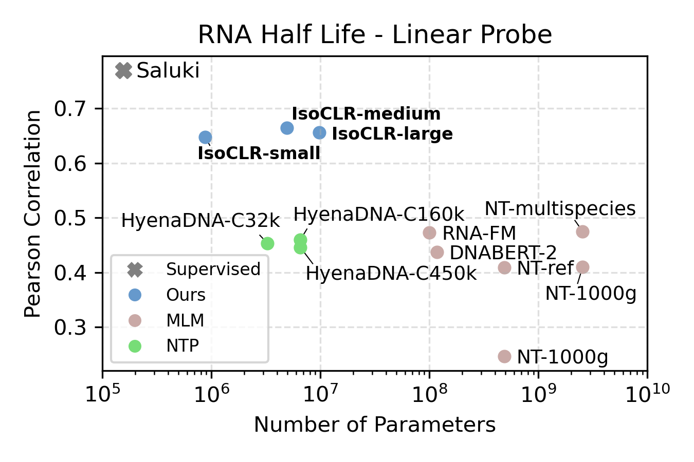
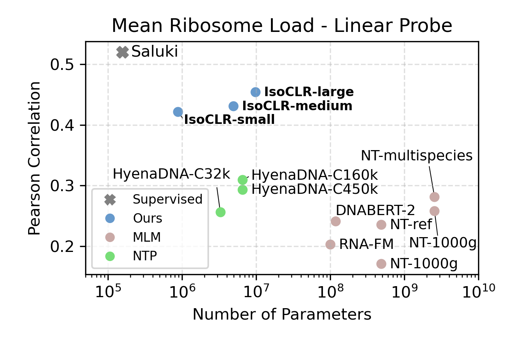

Contrastive RNA
================

``` sh
mamba env create -f environment.yml
cd contrastive_rna_representation
conda activate rna_contrast
pip install -e .
```

# Splicing up your predictions with RNA contrastive learning


#### [📄 ArXiv Paper](https://arxiv.org/abs/2310.08738)
#### [🌐 Blog Post](https://philechka.com/science/isoclr_2023.html) 

In our work “Splicing up your predictions with RNA contrastive learning”, we present a new self-supervised learning objective for mature spliced RNA. We utilize a contrastive loss to minimize the distance between functionally similar RNAs that have distinct sequences. This is conceptually similar to SimCLR in which the objective is to minimize the distance between augmented images (think cropping, rotation, recoloration). But you might ask: while there are clear semantic content preservation operations in images, how can we augment RNA while preserving its semantic content?

In IsoCLR, we propose that alternative splicingand gene duplication can be used as a source of sequence augmentation that largely preserves gene function. Our hypothesis is that RNAs prpoduced from the same gene will more often have the same function than RNAs from different genes. There are known cases of RNA isoforms from the same gene having different functions, but we argue that our approach is able to tolerate certain amount of noise. RNA splicing and gene duplication have been meticulously studied by biologists for the past 30 years and have been usually discussed in the context of disease. In this work we view RNA sequences generated by these processes as diversity generating mechanisms instead.

## RNA half-life and Mean Ribosome Load prediction with linear probing

We evaluated the model on two RNA regulatory processes that regulate protein production: RNA half-life and mean ribosome load. We focused our evaluation on linear probing to compare the quality of the representation against other self-supervised methods. We find that IsoCLR consistently outperformed methods that use a reconstruction objective like masked language modeling and next token prediction. 

 

## Technical files and their functionality

#### bpnet_dilated_conv.py
This module defines the basic building block of the DilatedConvNet - DilatedConv1DBasic

#### contrastive_model.py
This module runs the contrastive training. In it we initialize `ContrastiveModel` as well as the corresponding trainer and the losses. We can choose between DCL loss and NTXent loss. The script is run from `slurm/array_train_contrast.sh`. For us to run the script we need to construct the dataset as defined by dataset_path. This is done with `wite_contrastive_tf_record_dataset.py`.

#### data.py
This module defines the basic data objects required to construct the dataset. It defines the `RefseqDataset`, `Transcript` and the `Interval` class which are used to define the genomic intervals which create the Introns and Exons making up the dataset.

#### eval_loss_norms.py
Since in contrastive learning for RNA there aren't an even number of transcripts per gene (the number of transcripts is highly variable) we normalize the loss associated with each gene. We scale it by the log of the number of transcripts in each gene. We also add a scaling factor so that the corresponding norm of the loss is the same as without scaling. This script computes the norm of the loss for both dropping genes with single transcripts and for all. This scaling factor is then added to the `contrastive_model.py` script.

#### gene_dataset.py
This module defines the dataset construction functions that are used to construct the contrastive datasets used for training. They take in lists of annotated transcripts acquired from UCSC genome table browser. Those files indicate coordinates of transcripts in the reference genome. We then use the fundamental class objects like `Transcript` to construct these genomic objects and query their coordinates.

#### genome.py
This module is from Selene from Olga Troyanskaya's group `https://github.com/FunctionLab/selene`. Their dependencies were a little tricky so I just took the scripts that I needed from their codebase.

#### go_train.py
This module is for training and fine-tuning dilated ResNet models on the GO prediction tasks.

#### resnet.py
This module instantiates the ResNet models with dilation for RNA half-life prediction.

#### rna_half_life_trainer.py
This module is used for training and fine-tuning dilated ResNet models for RNA half-life prediction - the task that is used in the Saluki publication.

#### saluki_dataset.py
This module is from the Saluki publication which defines the dataset used for loading the RNA half-life data from the TFRecords.

#### saluki_layers.py
This module defines the Saluki model and the extra layers that they used in the model definition. This includes the shift and the scale layers.

#### sequence.py
This module is from Selene from Olga Troyanskaya's group `https://github.com/FunctionLab/selene`. Their dependencies were a little tricky so I just took the scripts that I needed from their codebase.

#### util.py
This module includes the miscellaneous functions that are used across different parts of the codebase. Dump anything annoying in here.

#### viz_model_latent.py
This module visualizes the latent space of the model in accordance with some metric.

#### write_contrastive_tf_record_dataset.py
This module creates the TF record dataset used for contrastive learning. It requires the fasta files associated with corresponding genomes, the transcriptome files annotating the locations of the transcripts as well as exon boundaries and also any additional homology files for creating the mapping within / between species.

